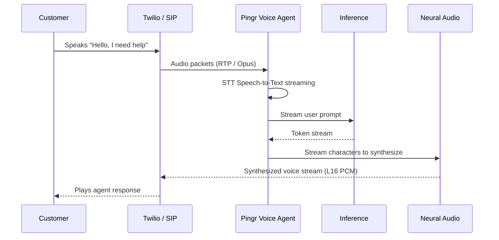

# Voice Agents in Pingr AI

Voice agents are the central orchestration entity in Pingr AI. Each agent configures:
1. **Prompt Intelligence**: System instructions, situational knowledge, guardrails, and role definitions.
2. **Speech-to-Text (STT)**: High-speed acoustic transcription engine (Deepgram Nova-2 or Whisper Realtime).
3. **Reasoning Engine (LLM)**: Fast conversational models (Claude 3.5 Sonnet, GPT-4o, or Gemini 1.5 Flash).
4. **Voice Synthesis (TTS)**: Low-latency neural voices (Cartesia Sonic, ElevenLabs Turbo v2, or PlayHT).

## Life Cycle of a Voice Call

## Agent Configuration Parameters

<ParamField path="name" type="string" required>
  Internal name used to identify the agent in reports and the console.
</ParamField>

<ParamField path="system_prompt" type="string" required>
  The system instruction provided to the language model during inference.
</ParamField>

<ParamField path="voice_id" type="string" default="cartesia/sonic-english">
  Identifier of the neural voice model used to generate speech.
</ParamField>

<ParamField path="interruption_threshold_ms" type="number" default="350">
  Millisecond duration of user voice activity before halting current agent playback.
</ParamField>
