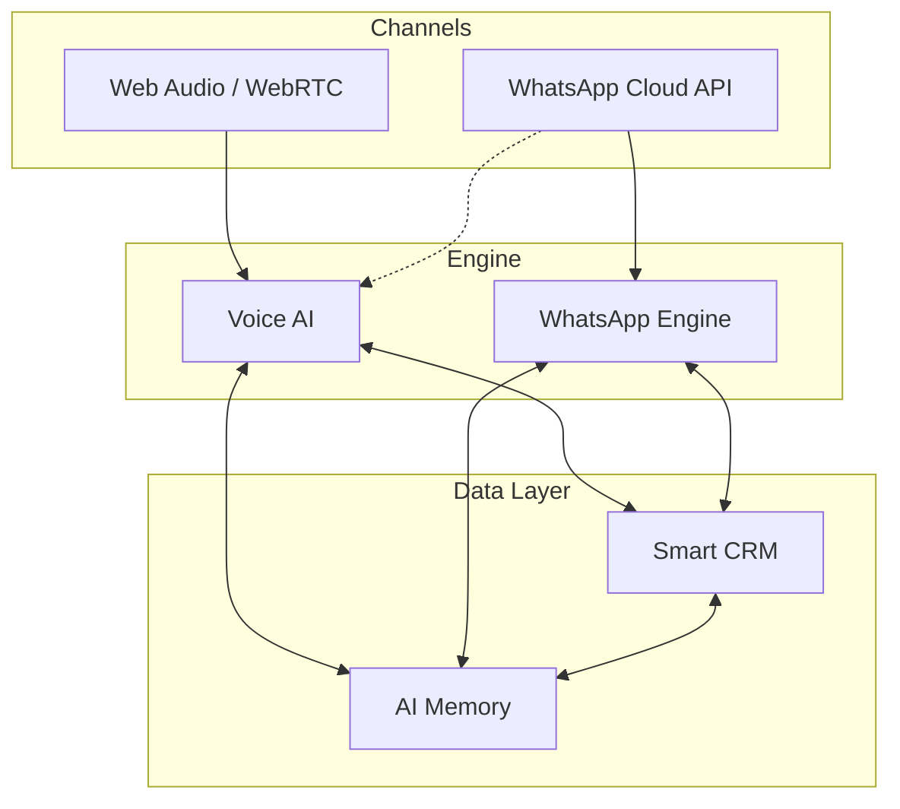

# Overview

Sayvy AI unifies Web Voice AI agents, WhatsApp Business automation, a native in-built CRM, and long-term conversational memory into a cohesive real-time conversational intelligence platform.

---

## Architecture

---

## The 4 Pillars

<CardGroup cols={2}>
  <Card title="Voice AI" icon="microphone" href="/documentation/voice/web-audio-webrtc">
    Browser WebRTC voice calls, WhatsApp audio, interruptions, and voice personas.
  </Card>
  <Card title="WhatsApp" icon="whatsapp" href="/documentation/whatsapp/setup">
    Meta Cloud API setup, messaging window, templates, and interactive buttons.
  </Card>
  <Card title="Smart CRM" icon="address-book" href="/documentation/crm/data-model-and-pipelines">
    Native contacts, deal pipelines, custom attributes, and interaction timelines.
  </Card>
  <Card title="AI Memory" icon="brain" href="/documentation/memory/identity-resolution">
    Cross-channel identity resolution, context buffers, semantic memory, and knowledge base.
  </Card>
</CardGroup>
