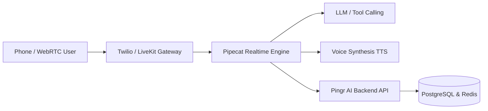

# Pingr AI Documentation

Pingr AI gives engineering and product teams ultra-low latency voice AI infrastructure. Connect telephony, WebRTC audio streams, intelligent conversation workflows, and multi-channel automations (WhatsApp & SMS) with zero operational headache.

<CardGroup cols={2}>
  <Card title="Quickstart" icon="bolt" href="/quickstart">
    Create your first voice agent and place a test call in under 5 minutes.
  </Card>
  <Card title="Authentication" icon="key" href="/authentication">
    Secure your API calls with Bearer tokens and scoped organization keys.
  </Card>
  <Card title="Voice Agents" icon="robot" href="/agents/overview">
    Configure system prompts, LLM parameters, voice synthesis, and tools.
  </Card>
  <Card title="API Reference" icon="code" href="/api-reference/overview">
    Explore the full REST API specification and interactive endpoint documentation.
  </Card>
</CardGroup>

## Architecture Highlights

- **Sub-500ms Audio Latency**: Streaming speech-to-text, LLM token streaming, and neural text-to-speech pipelines.
- **Bi-directional Interruption Handling**: Conversational barge-in allows users to interrupt natural speech smoothly.
- **Multi-channel Execution**: Automatically dispatch WhatsApp follow-ups, trigger webhooks, and log transcripts into CRM.
